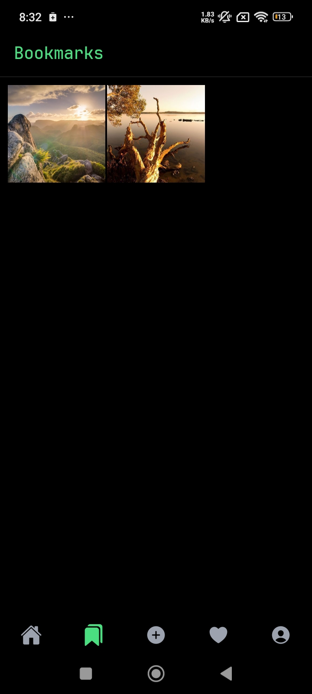

# 📱 Spotlight App - React Native Dummy Project

Welcome to **Spotlight App**, a mobile application developed as a **Project-Based Learning** experience using **React Native**. This project is a complete rewrite based on a tutorial by YouTuber [Codesistency](https://youtu.be/wbj-DuaL748?si=Qb_sa8OZgDcKvknQ), intended to deepen the understanding of modern mobile app development.

While the design and flow were inspired by the video, all the code was rewritten independently as a learning exercise.

## ✨ Features

- **Feed**: Browse posts from other users.
- **Like & Bookmark**: Like or bookmark your favorite posts.
- **Comment**: Leave comments on posts.
- **Create & Delete Posts**: Write your own posts and manage them.
- **Notifications**: Stay updated with real-time activity notifications.
- **Profile**: View and edit your user profile.

## 📱 Screenshots

<div style="display: flex; flex-wrap: wrap; gap: 10px;">
  
  
  
  
  
  
</div>

## 🛠 Tech Stack

- **Framework**: [React Native](https://reactnative.dev/) using [Expo](https://expo.dev/)
- **Authentication**: [Clerk](https://clerk.dev/)
- **Backend**: [Convex](https://www.convex.dev/)

## 🚀 Installation Guide

Follow these steps to run the project locally:

### Prerequisites

- Node.js & npm/yarn
- Expo CLI (`npm install -g expo-cli`)
- Clerk and Convex accounts (for backend and authentication setup)

### Steps

1. **Clone the Repository**
   ```bash
   git clone https://github.com/yourusername/spotlight-app.git
   cd spotlight-app
   ```

2. **Install Dependencies**
   ```bash
   npm install
   # or
   yarn install
   ```

3. **Configure Clerk & Convex**
- Register your app with [Clerk](https://clerk.dev) and obtain your `EXPO_PUBLIC_CLERK_PUBLISHABLE_KEY`.
- Create a project on [Convex](https://www.convex.dev) and get your `EXPO_PUBLIC_CONVEX_URL`.
- Create a `.env` file in the root directory and add the following configuration:

  ```
  EXPO_PUBLIC_CLERK_PUBLISHABLE_KEY=your_clerk_publishable_key

  # Deployment used by `npx convex dev`
  CONVEX_DEPLOYMENT=your_convex_deployment_id

  EXPO_PUBLIC_CONVEX_URL=your_convex_url

  CLERK_WEBHOOK_SECRET=your_clerk_webhook_secret
  ```

4. **Run the App**
   ```bash
   expo start
   ```

   You can open the app in an Android/iOS emulator or use the Expo Go app on your device.


## 🧑‍💻 Folder Structure

This project follows a modular structure for scalability and maintainability:

```
spotlight-app/
├── .expo/               # Expo configuration files
├── app/                 # Application routing & screens
│   ├── (auth)/          # Authentication-related screens
│   ├── (tabs)/          # Main tab navigation
│   └── user/            # User profile-related screens
│       ├── _layout.tsx  # Layout file for user route
│       └── index.tsx    # User index screen
├── assets/              # Images, icons, fonts, etc.
├── components/          # Reusable UI components
├── constants/           # App-wide constants (e.g., colors, sizes)
├── convex/              # Backend logic and Convex functions
├── node_modules/        # Project dependencies (auto-generated)
```

## 👤 Contributor

- **Fatwah Firmansyah SR** - [GitHub](https://github.com/FatwahFir)

Feel free to open an issue or pull request if you have suggestions or find any bugs!

## 📄 License

You are free to use, modify, and distribute the code.